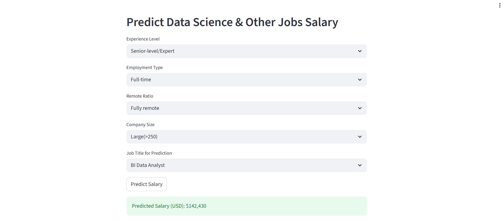
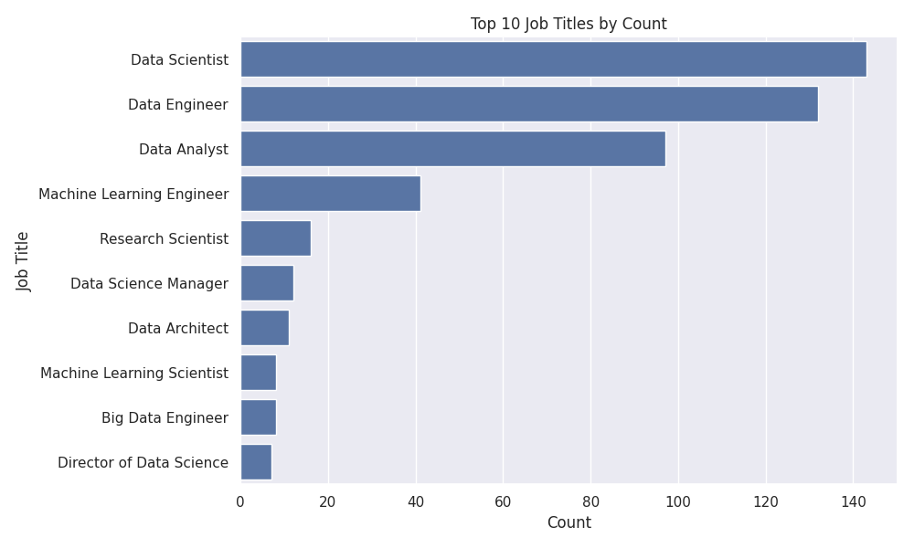
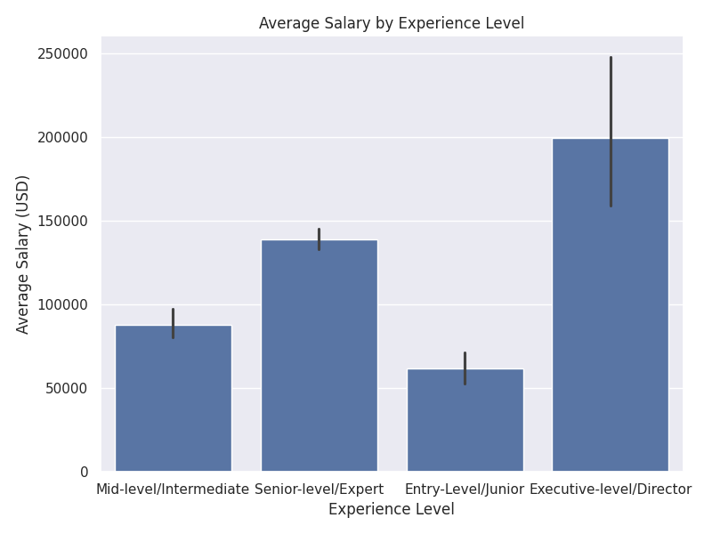

# Data-Science-Job-Salaries
Exploratory Data Analysis using dataset of Data Science Job Salaries


# Data Science Job Salaries — EDA

This repository contains a polished Exploratory Data Analysis (EDA) notebook for the **Data Science Job Salaries** dataset.

Objective: Analyze and model data science job salaries to uncover trends,
identify salary drivers, and predict salaries based on job-related factors.


## Files
- `Data science Job salaries.ipynb` — The Jupyter notebook with full EDA, visuals, and conclusions.
- `Data Science Job Salaries.csv` — Raw dataset (as uploaded by the user).

## Overview
This project inspects job postings and salary information to:
- Clean and standardize salary values.
- Visualize salary distribution and outliers.
- Compare salaries across job titles and experience levels.
- Explore geographic and remote-work trends.
- Provide actionable recommendations.

## How to run
1. Clone or upload files to a GitHub repo.
2. Open the notebook `Dat science Job salaries.ipynb` in Google Colab or Jupyter.
3. Ensure dependencies are installed:
Libriaries Used :

pandas: Data manipulation and analysis; loading, cleaning, and transforming tabular data.

numpy: Numerical operations and efficient array computations.

matplotlib: Creating static visualizations and plots.

seaborn: Statistical data visualization built on top of matplotlib; easier and more attractive plots.

scikit-learn: Machine learning library for model building, training, and evaluation.

ipykernel: Jupyter kernel for running Python code in notebooks.

streamlit: Building interactive web apps and dashboards for data science projects


```bash


pip install -r requirements.txt #for all the libariries in one txt

#To create and activate a Python virtual environment (venv) in your Codespace, use these #commands in your terminal:

python3 -m venv .venv
source .venv/bin/activate 

# to run  your streamlit  file
streamlit run Streamlit_DS_Salaries.py

```
## Salary Predictor App

Below is a screenshot of the interactive Data Science Salary Predictor built with Streamlit:




## Key Visualizations

**Top 10 Job Titles by Count**


**Average Salary by Experience Level**



## Conclusion

This project provides a comprehensive analysis of the Data Science Job Salaries dataset to uncover key trends and salary drivers in the data science job market. Through exploratory data analysis and predictive modeling, I found that:

Senior-level/Expert roles dominate the data science job market, while Executive-level/Director positions are rare.

The most common job titles are Data Scientist, Data Engineer, Data Analyst, and Machine Learning Engineer.

Full-time employment is overwhelmingly the norm in data science roles.

The United States has the highest concentration of both data science professionals and companies, but the highest average salaries are observed in Russia and the US.

Salaries and job opportunities have increased each year and with higher experience levels.

Medium and large companies tend to offer higher salaries compared to small companies.

The average salary for data science jobs in this dataset is approximately $112,298 USD.

A linear regression model was built to predict salaries based on job-related factors, enabling users to estimate expected compensation for various roles and profiles.
